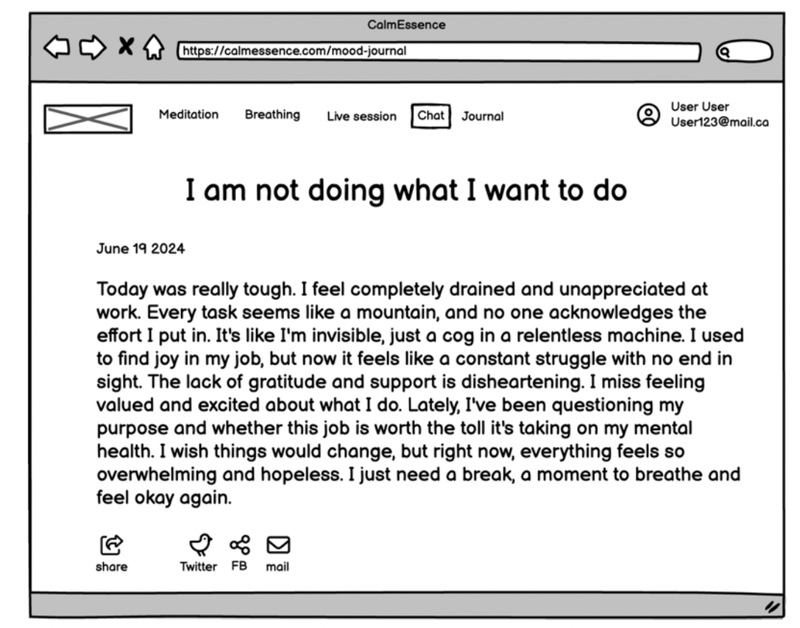

# Assignment 3 - Journaling

## Checkout out at [netlify](https://666115293eee5f28a87b14e4--subtle-lollipop-92b76a.netlify.app/)
* *Frontend application URL*: <https://thecalmessence.netlify.app/>
* *Backend application URL*: <https://csci-5709-group8.onrender.com>
* *Git URL*: <https://git.cs.dal.ca/parkar/CSCI-5709-Group8/-/tree/main/calmessence?ref_type=heads>

## Deployment

The project code available in the CalmEssencce directory was pushed to Github and then using the Netlify deployment deployed to the server.

Steps of Deployment:
1. Upload your code to the main branch of the GitHub repository.
2. Retrieve the calmessence project from GitHub and import it into Netlify.
3. Configure the build settings using npm run build and adjust the publish directory for deploying the application.
4. Access the live application at https://thecalmessence.netlify.app/.

## Built With

* [React](https://legacy.reactjs.org/docs/getting-started.html/) - The web framework used.
* [npm](https://docs.npmjs.com//) - Dependency Management
* [TailwindCSS](https://tailwindcss.com/) - Used for CSS and Responsiveness
* [Axios](https://www.npmjs.com/package/axios) - Used for API calls to the backend.
* [Fortawesome](https://www.npmjs.com/package/@fortawesome/react-fontawesome) - Used for icons.
* [ReactToastify](https://www.npmjs.com/package/react-toastify?activeTab=readme) - Used for toast messages for success and errors
* [AOS](https://www.npmjs.com/package/aos) - Animate on scroll library.
* [PropTypes](https://www.npmjs.com/package/prop-types) - Used for type-checking in React.
* [React Router DOM](https://www.npmjs.com/package/react-router-dom) - Used for routing in React applications.
* [React Scroll](https://www.npmjs.com/package/react-scroll) - Used for scrolling animations in React.
* [BlockNote](https://www.blocknotejs.org/) - WYSIWYG block based notion style editor in js 
* [React-Textarea-Autoscaling](https://www.npmjs.com/package/react-textarea-autosize) - Drop-in replacement for the textarea component which automatically resizes textarea as content changes.

 
## Dependencies

This template displays the lo-fidelity prototype implementation of the requirement

- Mood journal Management

    Create a Mood Entry_
    User Persona: User, a regular user

    Scenario:
    ```
    Platform user, feeling introspective after a long day, 
    opens the mindfulness app to record his current mood. 
    Upon logging into the app, he navigates to the mood journal section.
    He selects the option to create a new mood entry. 
    The app prompts him to select the date and time for the entry.
    User chooses the current date and time. Next, he selects his mood
    from a range of options, such as happy, sad, anxious, or calm.
    He also has the option to add notes to provide context to his mood. 
    Satisfied with his entry, User saves it and closes the app, feeling
    relieved to have captured his emotions for the day.
    ```

## Source Files
    
### Frontend
- Editor.jsx
    Editor creates and instantiates a new BlockNote instance, with initial configurations and BlockNote Schemas.
    BlockNote functions in block style notes like notion with rich text formatting and support for embedding videos
    and images
- Page.jsx
    Page creates a page depicting a notion like page for journal entry. The changes made on the page is automatically
    saved in mongoDB respective to user. The autosave feature is comparable to online text editors like google docs and notion.
- Cover.jsx
    Cover component is responsible for cover image of the journal page
- JournalCatalog.jsx
    JournalCatalog displays all the pages of user's journal in one place

#### Backend
- controllers/blogController.js
    Controller for all the journal pages - handles the request from the frontend
- models/db.js
    initializes mongodb Atlas connection
- models/blog.js
    sets up mongo db schema for the documents in the collection
- routes/blogRoutes
    sets up routes for the journal and maps to respective controller

## Wireframe

